# **Keyestudio IoT Smart Home Kit for ESP32**

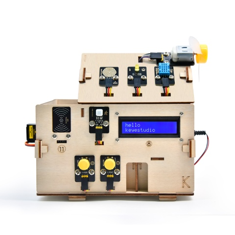

## 1.Description

As the rapid development of the Internet grows, various intelligent devices are gradually integrated into our daily life. For example, we can use RFID to open the door. In addition, the kitchen is equipped with a gas detection alarm, which alerts people to the danger when dangerous gas and large smoke are detected. When it detects rain, it can automatically collect clothes and close windows. All kinds of electrical equipment can be controlled by mobile phone, control lights, fans, air conditioning and so on.

In this connection, we seek to launch this smart home product with ESP32 control, which has a host of sensors and modules as well as networking function, making the relevant knowledge of the Internet more accessible to you.

## 2.Features

1.  Elegant appearance
2.  A host of sensor modules
3.  Mobile phone APP network control
4.  Morse password door
5.  It can automatically close windows
6.  RFID function
7.  C language and MicroPython

## 3.Kit list

| \# | Picture                                          | Name                                  | QTY               |
|----|---------------------------------------------------------------------------------------------------------------------------------------------------------------------|---------------------------------------|-------------------|
| 1  |  | Wooden Board                          | 1                 |
| 2  | 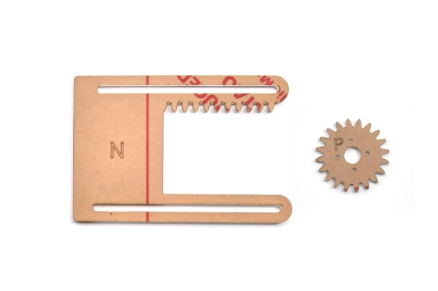 |  Acrylic Board                        | 1                 |
| 3  |  | ESP32 PLUS Development Board          | 1                 |
| 4  |   |  6812 RGB Module                      | 1                 |
| 5  |   | Analog Gas Sensor                     | 1                 |
| 6  | 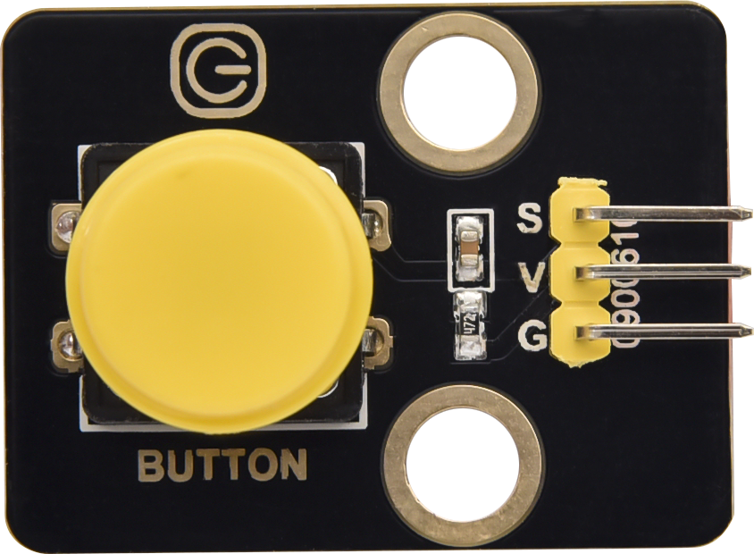  | Button Module                         | 2                 |
| 7  |   | RFID Module                           | 1                 |
| 8  |   | Passive Buzzer Module                 | 1                 |
| 9  |   | 130 Motor                             | 1                 |
| 10 |   | Steam Sensor                          | 1                 |
| 11 |   | XHT11 Temperature and Humidity Sensor | 1                 |
| 12 |   | PIR Motion Sensor                     | 1                 |
| 13 |   | Yellow LED Module                     | 1                 |
| 14 |   | Servo                                 | 2                 |
| 15 | 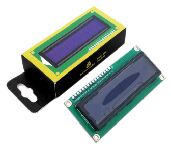  | I2C1602 LCD Module                    | 1                 |
| 16 |   | 3P F-F 150 mm Dupont Wire             | 5                 |
| 17 |   | 3P F-F 200 mm Dupont Wire             | 4                 |
| 18 |   | F-F 200 mm /40P/2.54 Wires            | 0.1 （4 strands） |
| 19 |   | 4P F-F 200 mm Splicing Dupont Wire    | 2                 |
| 20 |   | M1.4\*6MM Round Head Screws           | 10                |
| 21 |   | M3 Nickle-plated Nut(self-locking)    | 5                 |
| 22 |   | M4\*8MM Round Head Screws             | 24                |
| 23 |   | M3\*6MM Round Head Screws             | 9                 |
| 24 |   | M3\*10MM Round Head Screws            | 5                 |
| 25 |   | M2\*12MM Round Head Screws            | 5                 |
| 26 |   | M4 Nickle-plated Nut                  | 24                |
| 27 |   | M3 Nickle-plated Nut                  | 7                 |
| 28 |   | M2 Nickle-plated Nut                  | 6                 |
| 29 |   | M3\*8MM Flat Head Screws              | 3                 |
| 30 |  | Cross Wrench                          | 1                 |
| 31 |   | 3.0\*40MM Screwdriver                 | 1                 |
| 32 |   | 2.0\*40MM Screwdriver                 | 1                 |
| 33 |   | M3\*10MM Dual-pass Copper Pillar      | 4                 |
| 34 |   | USB Cable                             | 1                 |
| 35 |   | 6-Slot AA Battery Holder              | 1                 |
| 36 |   | M3\*12MM Round Head Screws            | 4                 |
| 37 |   | White Card                            | 1                 |
| 38 |   | ABS RFID Key                          | 1                 |

## 4.Get starter with Arduino

**1.ESP32 PLUS Development board**

ESP32PLUS is a universal WIFI plus Bluetooth development board based on ESP32, integrated with ESP32-WOROOM-32 module and compatible with Arduino.

It has a hall sensor, high-speed SDIO/SPI, UART, I2S as well as I2C. Furthermore, equipped with freeRTOS operating system, which is quite suitable for the Internet of things and smart home.

**2.Windows System**

**2.1 Installing Arduino IDE**

When you get control board, you need to download Arduino IDE and driver firstly.

You could download Arduino IDE from the official website:

<https://www.arduino.cc/>, click the **SOFTWARE** on the browse bar to enter download page, as shown below:

There are various versions of IDE for Arduino. Just download a version compatible with your system. Here we will show you how to download and install the windows version of Arduino IDE.

You can choose between the Installer (.exe) and the Zip packages. We suggest you use the first one that installs directly everything you need to use the Arduino Software (IDE), including the drivers. With the Zip package you need to install the drivers manually. The Zip file is also useful if you want to create a portable installation.

You just need to click JUST DOWNLOAD.

**2.2 Install a driver**

If you have installed the CH340 driver, just skip it.

Connect the main control board to your computer with a USB cable, and the driver will be installed automatically on MacOS and Windows10 system. If the driver installation process fails, you need to install the driver manually.

(1) Check whether the computer automatically installs the driver:

Right click Computer----- Click Properties-----Click Device Manager, the following picture shows the successful installation:

(2) Manual installation:

Right-click “**USB2.0-Serial**” and click “**Update drive...**”

Click “**Browse my computer for driver software**”

Click“**Browse...**”and select the“**usb_ch341_3.1.2009.06 folder**”.

Check the serial port connection status again, as shown in the following figure, the driver is successfully installed.

**2.3 Add the ESP32 Environment**

（1）Open the arduino IDE，click File \> Preferences，as shown below:

（2）Copy the link：

<https://dl.espressif.com/dl/package_esp32_index.json>

（3）Open the button marked below:

(4) Paste it inside and click OK, as shown below

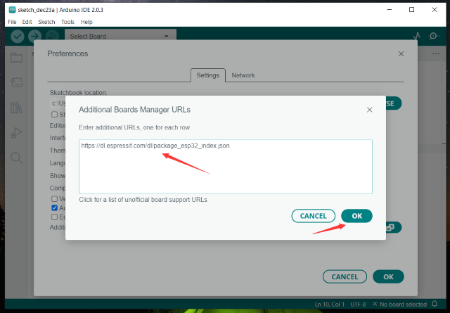

(5)  Click Tools \> Board \> Boards Manager

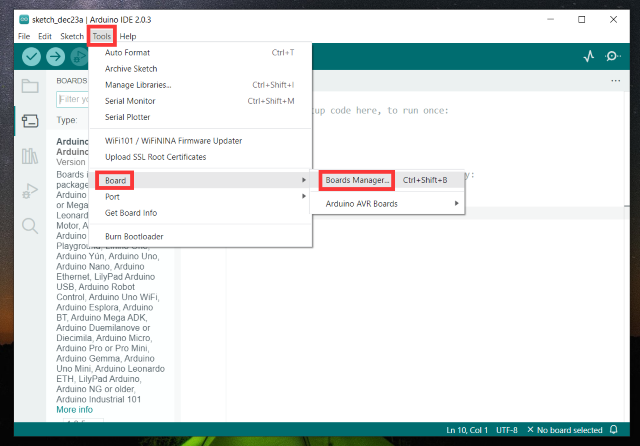

(6)  Find the ESP32 from the pop up Boards Manager and then click install.

(7)  Click Tools \> Board \>esp32 to choose the ESP32 Dev Module.

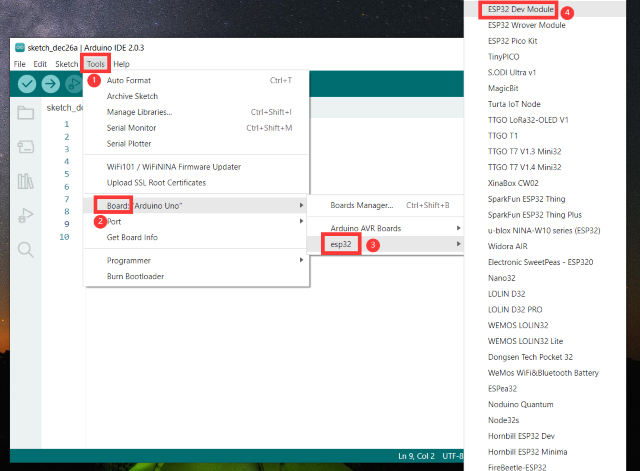

**2.4 Arduino IDE Setting**

Clickicon，open Arduino IDE.

To avoid the errors when uploading the program to the board, you need to select the correct Arduino board that matches the board connected to your computer.

Then come back to the Arduino software, you should click Tools→Board, select the board. (as shown below)

Then select the correct COM port (you can see the corresponding COM port after the driver is successfully installed)

Before uploading the program to the board, let’s demonstrate the function of each symbol in the Arduino IDE toolbar.

1- Used to verify whether there is any compiling mistakes or not.

2- Used to upload the sketch to your ESP32 board.

3- Used to send the serial data received from board to the serial plottle.

4- Used to send the serial data received from board to the serial monitor.

**3.Mac System**

**3.1 Download Arduino IDE**

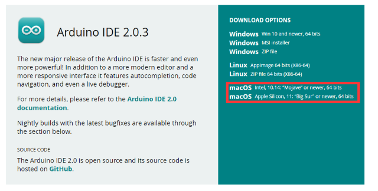

**3.2 Download the CH340 driver：**

CH340 chip driver for MAC

**3.3 How to install the CH340 driver：**

After the download, seen as below:  

Double-click installation package and tap Continue  

Click Install

Input your user password and click Install Software

Tap Continue Installation

Wait to install

Click Restart after the installation is finished

**3.4 Arduino IDE Setting:**

Except for COM ports, the setting method is the same as in chapter 1.4:

## 5.How to Add Libraries?

**What are Libraries ?**

[Libraries](https://www.arduino.cc/en/Reference/Libraries) are a collection of code that makes it easy for you to drive a sensor,display, module, etc.

For example, the built-in LiquidCrystal library helps talk to LCD displays. There are hundreds of additional libraries available on the Internet for download.

The built-in libraries and some of these additional libraries are listed in the reference.

<https://www.arduino.cc/en/Reference/Libraries>

**Add ZIP Libraries**

When you want to add a zip library, you need to download it as a ZIP file, put in the proper directory. The Libraries needed to run the mini tank can be found on：<https://fs.keyestudio.com/KS5009>

Click Sketch----\>Include Library—\>Add.ZIP Library，then Then navigate to the library file you downloaded and click "open."

Import the library. You can find it in the include library list.

## 6.How to install the smart home

| Step 1                                                                       |                                                   |
|------------------------------------------------------------------------------|---------------------------------------------------|
|    Components Required                                                       |    |
|   Installation Diagram                                                       |    |
|   Prototype                                                                  |    |
| Step 2                                                                       |                                                   |
|    Components Required                                                       |    |
|   Installation Diagram                                                       |    |
|   Prototype                                                                  |    |
| Step 3                                                                       |                                                   |
|    Components Required                                                       |    |
|  Installation                                                                | |
|   Prototype                                                                  |    |
| Step 4                                                                       |                                                   |
|    Components Required                                                       |    |
|   Installation Diagram                                                       |    |
|   Prototype                                                                  |    |
| Step 5                                                                       |                                                   |
|    Components Required                                                       |    |
|      Step 1                                                                  | 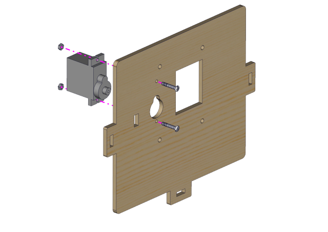   |
|   Prototype                                                                  |    |
| Step 6                                                                       |                                                   |
|    Components Required                                                       |    |
| Installation                                                                 |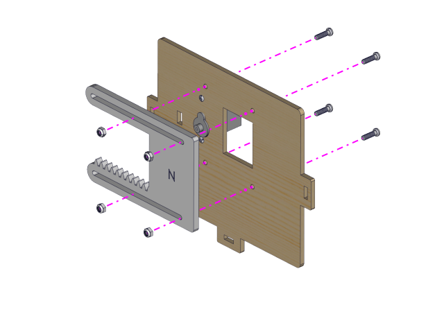   |
|   Prototype                                                                  |    |
| Step 7                                                                       |                                                   |
|    Components Required                                                       | 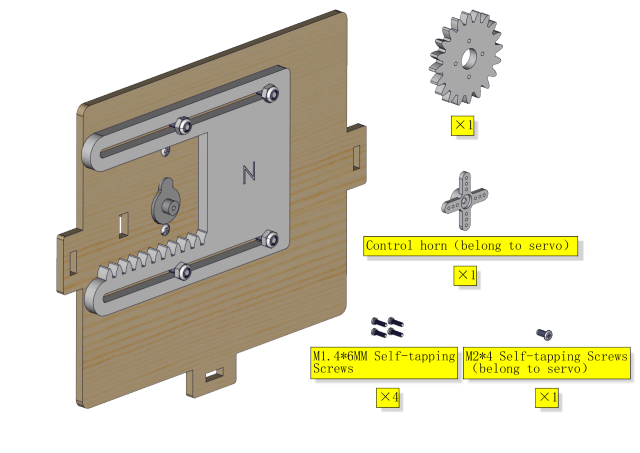   |
| Adjust the angle of the servo                                                | need to adjust the servo of the window to 0 degree before installation.|
| Installation                                                                 |    |
|   Prototype                                                                  |    |
| Step 8                                                                       |                                                   |
|    Components Required                                                       |    |
|   Installation Diagram                                                       |    |
|   Prototype                                                                  |    |
| Step 9                                                                       |                                                   |
|    Components Required                                                       |    |
|   Installation Diagram                                                       |    |
|   Prototype                                                                  |    |
| Step 10                                                                      |                                                   |
|    Components Required                                                       | 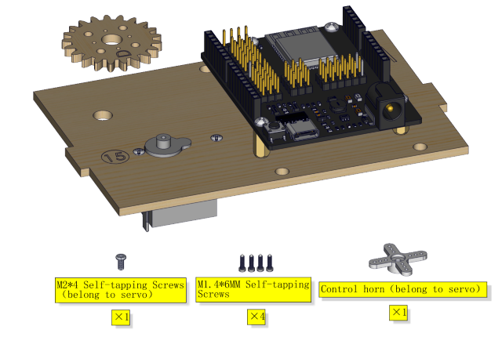   |
|   Installation Diagram                                                       |    |
|   Prototype                                                                  |    |
| Step 11                                                                      |                                                   |
|    Components Required                                                       |    |
|   Installation Diagram                                                       |    |
|   Prototype                                                                  | 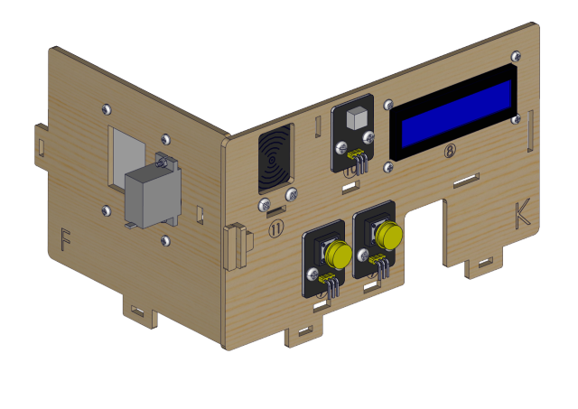   |
| Step 12                                                                      |                                                   |
|    Components Required                                                       |    |
|   Installation Diagram                                                       | 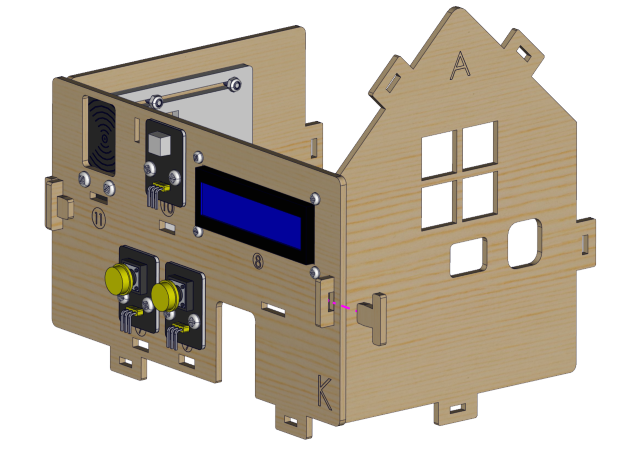   |
|   Prototype                                                                  |    |
| Step 13                                                                      |                                                   |
|    Components Required                                                       |    |
|   Installation Diagram                                                       |    |
|   Prototype                                                                  |    |
| Step 14                                                                      |                                                   |
|    Components Required                                                       |    |
|   Installation Diagram                                                       | 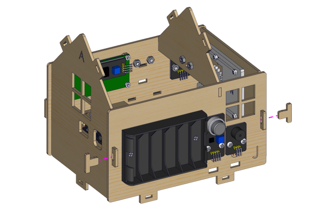   |
|   Prototype                                                                  |    |
| Step 15                                                                      |                                                   |
|    Components Required                                                       |    |
|   Installation Diagram                                                       |    |
|   Prototype                                                                  |    |
| Step 16                                                                      |                                                   |
|    Components Required                                                       |    |
|   Installation Diagram                                                       |    |
|   Prototype                                                                  |    |
| Step 17                                                                      |                                                   |
|    Components Required                                                       |    |
|   Installation Diagram                                                       | 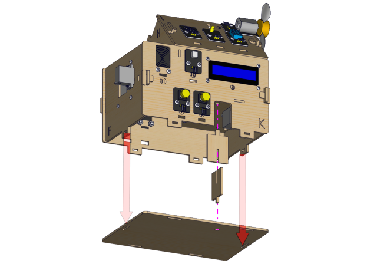   |
|   Prototype                                                                  |    |
| Step 18                                                                      |                                                   |
|    Components Required                                                       |    |
|   Installation Diagram                                                       |    |
|   Prototype                                                                  |    |
| Step 19                                                                      |                                                   |
|    Components Required                                                       |    |
|   Installation Diagram                                                       |    |
|   Prototype                                                                  |    |
| Wiring Part                                                                  |                                                   |
| dht11 to io17                                                                |    |
| yellow led  to io12                                                          |    |
| steam sensor to the io34                                                     |    |
| fan (IN- io18，IN+ io19）                                                    |    |
| PIR motion sensor to io14                                                    |    |
| left button module to io16                                                   |    |
| right button module to io27                                                  |    |
| RFID module to the IIC                                                       |    |
| LCD1602 display to the IIC                                                   |    |
| 6812RGB LED to the io26                                                      | 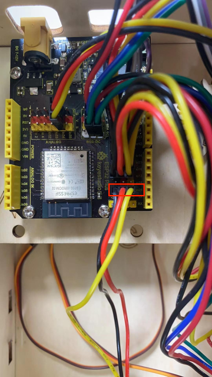   |
| gas sensor to the io23                                                       |    |
| buzzer to the io25                                                           |    |
| servo windows to the io5                                                     |    |
| servo doors to the io13                                                      |    |
|     power wiring                                                             |   |
| Step 20                                                                      |                                                   |
|    Components Required                                                       |    |
|   Installation Diagram                                                       |    |
|     Prototype                                                                |    |

## 7.Projects

Alright, let’s get straight to our projects. We will make you know the smart home deeply from the simple sensor.

**Note: In this course, the interface of each sensor / module marked with (G,-, GND) indicates the negative pole, G is connected to G, - or GND of sensor shield or control board; “V” is positive pole and connected with V, VCC or 5V.**

### Project 1.1 LED Blink

**1.Description**

We’ve installed the driver of ESP32 PLUS development board.

In the first lesson, we will conduct an experiment to make LED blink.

Let’s connect GND and VCC to power. The LED will be on when signal end S is high level, on the contrary, LED will turn off when signal end S is low level.

In addition, the different blinking frequency can be presented by adjusting the delayed time.

**2.Working Principle**

LED is also the light-emitting diode, which can be made into an electronic module. It will shine if we control pins to output high level, otherwise it will be off.

**3.**[**Parameter**](C:/Users/NINGMEI/AppData/Local/youdao/dict/Application/8.10.7.0/resultui/html/index.html#/javascript:;)**s**

| Working voltage | DC 3\~5V |
|-----------------|----------|
| Working current | \<20mA   |
| Power           | 0.1W     |

**4.Control Pin**

| Yellow LED connected to io12|  
|------------|
||

**5.Test Code**

| \#define led_y 12 //Define the yellow led pin to 12  void setup() { //The code inside the setup function runs only once  pinMode(led_y, OUTPUT); //Set pin to output mode }  void loop() { //The code inside the loop function will always run in a loop  digitalWrite(led_y, HIGH); //Light up the LED  delay(200); //Delay statement, in ms  digitalWrite(led_y, LOW); //Close the LED  delay(200); } |

**6.Test Result**

After uploading the code , you can see white and yellow LEDs flashing together.

### Project 1.2 Breathing LED

**1.Description**

A“breathing LED”is a phenomenon where an LED's brightness smoothly changes from dark to bright and back to dark, continuing to do so and giving the illusion of an LED“breathing. However, how to control LED’s brightness?

It makes sense to take advantage of PWM. Output the number of high level and low level in unit time, the more time the high level occupies, the larger the PWM value, the brighter the LED.

We provide the PWM output library file \< analogwrite.h \> for ESP32, therefore solely a simple statement analogWrite(); can control the PWM output.

**2.Control Pin**

| Yellow LED connected to io12|  
|------------|
||

**3.Test Code**

| \#include \<analogWrite.h\> //Import PWM output library files \#define led_y 12 //Define LED pins   void setup(){  pinMode(led_y, OUTPUT); //Set pin to output mode }  void loop(){  for(int i=0; i\<255; i++) //The for loop statement increments the value of variable i until it exits the loop at 255   {  analogWrite(led_y, i); //PWM output, control LED brightness  delay(3);  }  for(int i=255; i\>0; i--) //The for loop statement continues to decrease the value of variable i until it exits the loop at 0  analogWrite(led_y, i);  delay(3);  } } |

**4.Test Result**

The LED gradually gets dimmer then brighter, cyclically, like human breathe.

### Project 2.1 Read the Button

**1. Description**

The common table lamp uses LED lights and buttons, which can control the light on and off pressing the button.

We will work to read the status value of the button and display it on the serial monitor, so as to see it intuitively.

**2.Button Principle**

The button module is a digital sensor, which can only read 0 or 1. When the module is not pressed, it is in a high level state, that is, 1, when pressed, it is a low level 0.

**3.Pins of the Button**

| Button 1 | 16 |
|----------|----|
| Button 2 | 27 |

**4.Test Code**

| \#define btn1 16 \#define btn2 27  void setup() {  Serial.begin(9600);  pinMode(btn1, INPUT);  pinMode(btn2, INPUT); }  void loop() {  boolean btn1_val = digitalRead(btn1);  boolean btn2_val = digitalRead(btn2);  Serial.print("button1 = ");  Serial.print(btn1_val);  Serial.print(" ");  Serial.print("button2 = ");  Serial.println(btn2_val);  delay(100); } |

**5.Test Result**

Open the serial monitor of the arduino IDE

Press the button again to see the change of the button state value, as shown below:

### Project 2.2. Table Lamp

**1. Description**

For common simple table lamp, click the button it will be opened, click it again, the lamp will be closed.

**2.Test Code**

Calculate the clicked button times and take the remainder of 2, you can get 0 or 1 two state values.

| \#define btn1 16 \#define led_y 12 int btn_count = 0; //Used to count the clicked button times   void setup() {  Serial.begin(9600);  pinMode(btn1, INPUT);  pinMode(led_y, OUTPUT); }  void loop() {  boolean btn1_val = digitalRead(btn1);  if(btn1_val == 0) //If the button is pressed  {  delay(10); //Delay 10ms to eliminate button jitter  if(btn1_val == 0) //Make sure the button is pressed again   {  boolean btn_state = 1;  while(btn_state == 1) //Loop indefinitely until the button is released  {  boolean btn_val = digitalRead(btn1);  if(btn_val == 1) //If the button is released  {  btn_count++; //Automatically increments by 1, account the clicked button times  Serial.println(btn_count);  btn_state = 0; //The button is released and exits the loop  }  }  }  boolean value = btn_count % 2; //Take the remainder of the value, you will get 0 or 1  if(value == 1)  {  digitalWrite(led_y, HIGH);  }  else{  digitalWrite(led_y, LOW);  }  } }  |

**3.Test Result**

Open the serial monitor and print out the clicked button times, then click the button once, the LED will be on, click it again, it will be off.

### Project 3.1 Read the PIR Motion Sensor

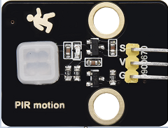

**1. Description**

The PIR motion sensor has many application scenarios in daily life, such as automatic induction lamp of stairs, automatic induction faucet of washbasin, etc.

It is also a digital sensor like buttons, which has two state

values 0 or 1. And it will be sensed when people are moving.

We will print out the value of the PIR motion sensor through the serial monitor.

**2.Control Pin**

| PIR motion sensor  |  14 |
|--------------------|-----|
|                    |     |

**3.Test Code**

| \#define pyroelectric 14  void setup() {  Serial.begin(9600);  pinMode(pyroelectric, INPUT); }  void loop() {  boolean pyroelectric_val = digitalRead(pyroelectric);  Serial.print("pyroelectric value = ");  Serial.println(pyroelectric_val);  delay(200); } |

**4.Test Result**

When you stand still in front of the sensor, the reading value is 0, move a little, it will change to 1.

### Project 3.2 PIR Motion Sensor

If someone moves in front of the sensor, the LED will light up.

**1.Test Code**

| \#define pyroelectric 14 \#define led_y 12 //Define the yellow led pin to 12 void setup() {  Serial.begin(9600);  pinMode(pyroelectric, INPUT);  pinMode(led_y, OUTPUT); //Set pin to output mode }  void loop() {  boolean pyroelectric_val = digitalRead(pyroelectric);  Serial.print("pyroelectric value = ");  Serial.println(pyroelectric_val);  delay(200);  if(pyroelectric_val == 1)  {  digitalWrite(led_y, HIGH);  }else{  digitalWrite(led_y, LOW);  } } |

**2.Test Result**

Move your hand in front of the sensor, the LED will turn on. After 5s of immobility, the LED lights will turn off.

### Project 4.1 Play Happy Birthday

**1. Description**

There is a audio power amplifier element in the car expansion board, which is as an external amplification equipment to play music.

In this project, we will work to play a piece of music by using it.

**2. Component Knowledge**

**Passive Buzzer:** The audio power amplifier (like the passive buzzer) does not have internal oscillation. When controlling, we need to input square waves of different frequencies to the positive pole of the component and ground the negative pole to control the power amplifier to chime sounds of different frequencies.

1.  **Control Pin**

|  Passive Buzzer | 25 |
|-----------------|----|
|                 |    |

**1. Test Code**

| \#include \<ESP32Tone.h\> \#define buzzer_pin 25  void setup() {  pinMode(buzzer_pin, OUTPUT);  birthday(); }  void loop() {   }  void birthday() {  tone(buzzer_pin,294,250,0); //The four parameters are pin, frequency, delay and channel   tone(buzzer_pin,440,250,0);  tone(buzzer_pin,392,250,0);  tone(buzzer_pin,532,250,0);  tone(buzzer_pin,494,250,0);  tone(buzzer_pin,392,250,0);  tone(buzzer_pin,440,250,0);  tone(buzzer_pin,392,250,0);  tone(buzzer_pin,587,250,0);  tone(buzzer_pin,532,250,0);  tone(buzzer_pin,392,250,0);  tone(buzzer_pin,784,250,0);  tone(buzzer_pin,659,250,0);  tone(buzzer_pin,532,250,0);  tone(buzzer_pin,494,250,0);  tone(buzzer_pin,440,250,0);  tone(buzzer_pin,698,250,0);  tone(buzzer_pin,659,250,0);  tone(buzzer_pin,532,250,0);  tone(buzzer_pin,587,250,0);  tone(buzzer_pin,532,500,0);  noTone(buzzer_pin,0); //Close } |

**2. Test Result**

The passive buzzer will play happy Birthday.

### Project 4.2 Music Box

we will make a music box and switch tunes by pressing buttons.

**1. Test Code**

| \#include \<ESP32Tone.h\> \#include \<musicESP32_home.h\>  music Music(25); \#define btn1 16 int btn_count = 0; //Used to count the clicked button times  boolean music_flag = 0;  void setup() {  Serial.begin(9600);  pinMode(btn1, INPUT);  pinMode(25, OUTPUT); // Music.tetris(); // Music.birthday(); // Music.Ode_to_Joy(); // Music.christmas(); // Music.super_mario(); // Music.star_war_tone(); }  void loop() {  boolean btn1_val = digitalRead(btn1);  if(btn1_val == 0) //If the button is pressed  {  delay(10); //Delay 10ms to eliminate button jitter  if(btn1_val == 0) //Make sure the button is pressed again   {  boolean btn_state = 1;  while(btn_state == 1) //Loop indefinitely until the button is released  {  boolean btn_val = digitalRead(btn1);  if(btn_val == 1) //If the button is released  {  music_flag = 1;  btn_count++; //Automatically increments by 1 to count the number of times the button is clicked  Serial.println(btn_count);  if(btn_count == 4)  {  btn_count = 1;  }  switch(btn_count)  {  case 1: if(music_flag == 1){Music.Ode_to_Joy();music_flag=0;} break;  case 2: if(music_flag == 1){Music.christmas();music_flag=0;} break;  case 3: if(music_flag == 1){Music.tetris();music_flag=0;} break;  }  btn_state = 0; //The button is released and exits the loop  }  }  }  } } |

**2. Test Result**

Click button 1 once, it will play a tetris, then click it again, it will play Ode_to_Joy, after playing, click the button 1 for the third time, it will play Christmas.

### Project 5.1 Control the Door

1.  **Description**

Automatic doors and windows need power device, which will become more automatic with a 180 degree servo and some sensors. Adding a raindrop sensor, you can achieve the effect of closing windows automatically when raining. If adding a RFID, we can realize the effect of swiping to open the door and so on.

1.  **Component Knowledge**

**Servo:** Servo is a position servo [driver](C:/Users/NINGMEI/AppData/Local/youdao/dict/Application/8.10.7.0/resultui/html/index.html#/javascript:;) device consists of a housing, a circuit board, a coreless motor, a gear and a position detector.

Its working principle is that the servo receives the signal sent by MCU or receiver and produces a reference signal with a period of 20ms and width of 1.5ms, then compares the acquired DC bias voltage to the voltage of the potentiometer and obtain the voltage difference output.

The IC on the circuit board judges the direction of rotation, and then drives the coreless motor to start rotation. The power is transmitted to the swing arm through the reduction gear, and the signal is sent back by the position detector to judge whether the positioning has been reached, which is suitable for those control systems that require constant angle change and can be maintained.

When the motor speed is constant, the potentiometer is driven to rotate through the cascade reduction gear, which leads that the voltage difference is 0, and the motor stops rotating. Generally, the angle range of servo rotation is 0° --180 °.

The pulse period of the control servo is 20ms, the pulse width is 0.5ms \~ 2.5ms, and the corresponding position is -90°\~ +90°. Here is an example of a 180° servo:

In general, servo has three lines in brown, red and orange. The brown wire is grounded, the red one is a positive pole line and the orange one is a signal line.

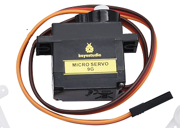

1.  **Pin**

| The servo of the window | 5  |
|-------------------------|----|
| The servo of the door   | 13 |

**4.Test Code**

| \#include \<ESP32_Servo.h\> Servo myservo; // create servo object to control a servo  // 16 servo objects can be created on the ESP32   int pos = 0; // variable to store the servo position // Recommended PWM GPIO pins on the ESP32 include 2,4,12-19,21-23,25-27,32-33  int servoPin = 13;   void setup() {  myservo.attach(servoPin); // attaches the servo on pin 18 to the servo object  }  void loop() {  for (pos = 0; pos \<= 180; pos += 1) { // goes from 0 degrees to 180 degrees  // in steps of 1 degree  myservo.write(pos); // tell servo to go to position in variable 'pos'  delay(15); // waits 15ms for the servo to reach the position  }  for (pos = 180; pos \>= 0; pos -= 1) { // goes from 180 degrees to 0 degrees  myservo.write(pos); // tell servo to go to position in variable 'pos'  delay(15); // waits 15ms for the servo to reach the position  } } |

**5.Test Result**

The servo of the door turns with the door, back and forth

### Project 5.2 Close the Window

1.  **Description**

We will work to use a servo and a raindrop sensor to make an device closing windows automatically when raining.

1.  **Component Knowledge**

**Raindrop Sensor:** This is an analog input module, the greater the area covered by water on the detection surface, the greater the value returned (range 0\~4096).

1.  **Test Code**

|  \#include \<ESP32_Servo.h\> Servo myservo; \#define servoPin 5 \#define waterPin 34   void setup() {  Serial.begin(9600);  pinMode(waterPin, INPUT);  myservo.attach(servoPin);  myservo.write(176);  delay(200); }  void loop() {  int water_val = analogRead(waterPin);  Serial.println(water_val);  if(water_val \> 1500) {  myservo.write(0);  delay(200);  }  else {  myservo.write(176);  delay(200);  } } |

1.  **Test Result**

At first, the window opens automatically, and when you touch the raindrop sensor with your hand (which has water on the skin), the window will close.

### Project 6.1 Control SK6812

1.  **Description**

The atmosphere lamp of smart home is 4 SK6812RGB LEDs. RGB LED belongs to a simple luminous module, which can adjust the color to bring out the lamp effect of different colors. Furthermore, it can be widely used in buildings, bridges, roads, gardens, courtyards, floors and other fields of decorative lighting and venue layout, Christmas, Halloween, Valentine's Day, Easter, National Day as well as other festivals during the atmosphere and other scenes.

In this experiment, we will make various lighting effects.

1.  **Component Knowledge**

From the schematic diagram, we can see that these four RGB LEDs are all connected in series. In fact, no matter how many they are, we can use a pin to control a RGB LED and let it display any color. Each RGBLED is an independent pixel, composed of R, G and B colors, which can achieve 256 levels of brightness display and complete the full true color display of 16777216 colors.

What’s more, the pixel point contains a data latch signal shaping amplifier drive circuit and a signal shaping circuit, which effectively ensures the color of the pixel point light is highly consistent.

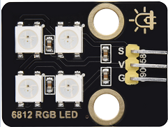

1.  **Pin**

| SK6812 | 26 |
|--------|----|
|        |    |

**4. Test Code**

Please open the provided test code pj6_1_SK6812, as shown in the image below:

**5. Test Result**

The atmosphere lamps of the smart home will display a variety of colors and light effects.

### Project 6.2 Button

1.  **Description**

There are two buttons to switch the color of the atmosphere lamp.

1.  **Test Code**

Please open the provided test code pj6_2_btn_6812, as shown below:

1.  **Test Result**

We can switch the color of the atmosphere lamp by clicking buttons 1 and 2.

### Project 7.1 Control the Fan

1.  **Description**

In this project, we will learn how to make a small fan.

1.  **Component Knowledge**

The small fan uses a 130 DC motor and safe fan blades. You can use PWM output to control the fan speed.

1.  **Control Method**

Two pins are required to control the motor of the fan, one for INA and two for INB. The PWM value range is 0\~255. When the PWM output of the two pins is different, the fan can rotate.

| INA - INB \<= -45  | Rotate clockwise                                                                                                               |
|--------------------|--------------------------------------------------------------------------------------------------------------------------------|
| INA - INB \>= 45   | Rotate [anticlockwise](C:/Users/NINGMEI/AppData/Local/youdao/dict/Application/8.10.7.0/resultui/html/index.html#/javascript:;) |
| INA == 0, INB == 0 | Stop                                                                                                                           |

1.  **Control Pins**

| INA | 19 |
|-----|----|
| INB | 18 |

**5. Test Code**

| \#include \<analogWrite.h\> \#define fanPin1 19 \#define fanPin2 18  void setup() {  pinMode(fanPin1, OUTPUT);  pinMode(fanPin2, OUTPUT); }  void loop() {  digitalWrite(fanPin1, LOW); //pwm = 0  analogWrite(fanPin2, 180);  delay(3000);  digitalWrite(fanPin1, LOW);  digitalWrite(fanPin2, LOW);  delay(1000);  digitalWrite(fanPin1, HIGH); //pwm = 255  analogWrite(fanPin2, 210);  delay(3000);  digitalWrite(fanPin1, LOW);  digitalWrite(fanPin2, LOW);  delay(1000); } |

**6. Test Result**

The fan will rotate clockwise and [anticlockwise](C:/Users/NINGMEI/AppData/Local/youdao/dict/Application/8.10.7.0/resultui/html/index.html#/javascript:;) at different

speeds.

### Project 7.2 Switch On or Off the Fan

One button switches the fan on and the other button controls the speed of the fan.

**1. Test Code**

| \#include \<analogWrite.h\> \#define fanPin1 19 \#define fanPin2 18 \#define btn1 16 int btn_count = 0; //Used to count the clicked button times  \#define btn2 27 int btn_count2 = 0; int speed_val = 130; //Define the speed variables  void setup() {  Serial.begin(9600);  pinMode(btn1, INPUT);  pinMode(btn2, INPUT);  pinMode(fanPin1, OUTPUT);  pinMode(fanPin2, OUTPUT); }  void loop() {  boolean btn1_val = digitalRead(btn1);  if(btn1_val == 0) //If the button is pressed  {  delay(10); //Delay 10ms to eliminate button jitter  if(btn1_val == 0) //Make sure the button is pressed again   {  boolean btn_state = 1;  while(btn_state == 1) //Loop indefinitely until the button is released  {  boolean btn_val = digitalRead(btn1);  if(btn_val == 1) //If the button is released  btn_count++; //Automatically increments by 1 to count the clicked button times   Serial.println(btn_count);  btn_state = 0; //The button is released and exits the loop  }  }  }  boolean value = btn_count % 2; //Take the remainder of the value, you will get 0 or 1  while(value == 1)  {  //Serial.println("on");  digitalWrite(fanPin1, LOW); //pwm = 0  analogWrite(fanPin2, speed_val);    boolean btn2_val = digitalRead(btn2);  if(btn2_val == 0)  {  delay(10);  if(btn2_val == 0)  {  boolean btn_state2 = 1;  while(btn_state2 == 1)  {  boolean btn2_val = digitalRead(btn2);  if(btn2_val == 1)  {  btn_count2++;  if(btn_count2 \> 3)  {  btn_count2 = 1;  }  switch(btn_count2)  {  case 1: speed_val = 130; Serial.println(speed_val);break; //Adjust the speed  case 2: speed_val = 180; Serial.println(speed_val);break;  case 3: speed_val = 230; Serial.println(speed_val);break;  }  btn_state2 = 0;  }  }  }  }  boolean btn1_val = digitalRead(btn1);  if(btn1_val == 0) //If the button is pressed  {  digitalWrite(fanPin1, LOW); //pwm = 0  analogWrite(fanPin2, 0);  value = 0; //Exit the loop   }    }  } }  |

**2. Test Result**

Click button 1, the fan starts to rotate, click button 2, the

speed can be adjusted(there are three different speeds), press the button 1 again, the fan stops.

### Project 8.1 Display [Character](C:/Users/NINGMEI/AppData/Local/youdao/dict/Application/8.10.7.0/resultui/html/index.html#/javascript:;)s

1.  **Description**

As we all know, screen is one of the best ways for people to interact with electronic devices.

1.  **Component Knowledge**

1602 is a line that can display 16 characters. There are two lines, which use IIC communication protocol.

1.  **Control Pins**

| SDA | SDA |
|-----|-----|
| SCL | SCL |

**4. Test Code**

| \#include \<Wire.h\> \#include \<LiquidCrystal_I2C.h\>  LiquidCrystal_I2C mylcd(0x27,16,2);  void setup(){  mylcd.init();  mylcd.backlight(); }  void loop(){  mylcd.setCursor(0, 0);  mylcd.print("hello");  mylcd.setCursor(0, 1);  mylcd.print("keyestudio");  //mylcd.clear(); } |

**5. Test Result**

The first line of the LCD1602 shows hello and the second line shows keyestudio.

### Project 8.2 Dangerous Gas Alarm

**1. Description**

When a gas sensor detects a high concentration of dangerous gas, the buzzer will sound an alarm and the display will show dangerous.

**2. Component Knowledge**

**MQ2 Smoke Sensor**: It is a gas leak monitoring device for homes and factories, which is suitable for liquefied gas, benzene, alkyl, alcohol, hydrogen as well as smoke detection. Our sensor leads to digital pin D and analog output pin A, which is connected to D as a digital sensor in this project .

**3. Test Code**

| \#include \<Wire.h\> \#include \<LiquidCrystal_I2C.h\> LiquidCrystal_I2C mylcd(0x27,16,2); \#define gasPin 23 \#define buzPin 25 boolean i = 1; boolean j = 1;  void setup(){  Serial.begin(9600);  mylcd.init();  mylcd.backlight();  pinMode(buzPin, OUTPUT);  pinMode(gasPin, INPUT);  mylcd.setCursor(0, 0);  mylcd.print("safety"); }  void loop(){  boolean gasVal = digitalRead(gasPin); //Reads the value detected by the gas sensor  Serial.println(gasVal);  if(gasVal == 0) //If the hazardous gas is detected，LCD displays dangerous，the buzzer makes an alarm  {  while(i == 1)  {  mylcd.clear();  mylcd.setCursor(0, 0);  mylcd.print("dangerous");  i = 0;  j = 1;  }  digitalWrite(buzPin,HIGH);  delay(1);  digitalWrite(buzPin,LOW);  delay(1);  }  else{  digitalWrite(buzPin,LOW);  while(j == 1)  {  mylcd.clear();  mylcd.setCursor(0, 0);  mylcd.print("safety");  i = 1;  j = 0;  }  } } |

1.  **Test Result**

The screen displays "safety" in normal state. However, when the gas sensor detects some dangerous gases, such as carbon monoxide, at a certain concentration, the buzzer will sound an alarm and the screen displays "dangerous".

### Project 9 Temperature and Humidity Tester

1.  **Component Knowledge**

Its communication mode is serial data and single bus. The temperature measurement range is -20 \~ +60℃, accuracy is ±2℃. However, the humidity range is 5 \~ 95%RH, the accuracy is ±5%RH.

1.  **Control Pin**

| Temperature and Humidity Sensor  | 17 |
|----------------------------------|----|
|                                  |    |

**3. Test Code**

| //\*\*\*\*\*\*\*\*\*\*\*\*\*\*\*\*\*\*\*\*\*\*\*\*\*\*\*\*\*\*\*\*\*\*\*\*\*\*\*\*\*\*\*\*\*\*\*\*\*\*\*\*\*\*\*\*\*\*\*\*\*\*\*\*\*\*\*\*\*\*\*\*\*\*\*\*\*\*\*\*\*\* /\*   \* Filename : xht11  \* Description : Read the temperature and humidity values of XHT11.  \* Auther : http//www.keyestudio.coml \*/ \#include \<Wire.h\> \#include \<LiquidCrystal_I2C.h\> LiquidCrystal_I2C mylcd(0x27,16,2); \#include "xht11.h" xht11 xht(17);  unsigned char dht[4] = {0, 0, 0, 0};//Only the first 32 bits of data are received, not the parity bits void setup() {  Serial.begin(9600);//Start the serial port monitor and set baud rate to 9600  mylcd.init();  mylcd.backlight(); }  void loop() {  if (xht.receive(dht)) { //Returns true when checked correctly  Serial.print("RH:");  Serial.print(dht[0]); //The integral part of humidity, DHT [1] is the fractional part  Serial.print("% ");  Serial.print("Temp:");  Serial.print(dht[2]); //The integral part of temperature, DHT [3] is the fractional part  Serial.println("C");    mylcd.setCursor(0, 0);  mylcd.print("T = ");  mylcd.print(dht[2]);  mylcd.setCursor(0, 1);  mylcd.print("H = ");  mylcd.print(dht[0]);  //mylcd.clear();  delay(200);  } else { //Read error  Serial.println("sensor error");  }  delay(1000); //It takes 1000ms to wait for the device to read } //\*\*\*\*\*\*\*\*\*\*\*\*\*\*\*\*\*\*\*\*\*\*\*\*\*\*\*\*\*\*\*\*\*\*\*\*\*\*\*\*\*\*\*\*\*\*\*\*\*\*\*\*\*\*\*\*\*\*\*\*\*\*\*\*\*\*\*\*\*\*\*\*\*\*\*\*\*\*\*\*\*\* |

**4. Test Result**

The LCD1602 displays the temperature (T = \*\* ° C) and humidity (H = \*\* %RH). When you breathe into the T/H sensor, you can see that the humidity rises.

### Project 10 Open the Door

1.  **Component Knowledge**

Radio frequency identification, the card reader is composed of a radio frequency module and a high-level magnetic field. The Tag transponder is a sensing device, which doesn’t contain a battery. It only contains tiny integrated circuit chips and media for storing data and antennas for receiving and transmitting signals.

To read the data in the tag, first put it into the reading range of the card reader. The reader will generate a magnetic field, which can produce electricity according to Lenz's law, then the RFID tag will supply power, thereby activating the device.

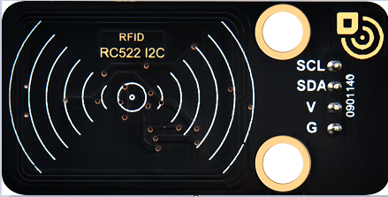

1.  **Control Pins**

Use IIC communication

| SDA | SDA |
|-----|-----|
| SCL | SCL |

**3. Test Code**

| //\*\*\*\*\*\*\*\*\*\*\*\*\*\*\*\*\*\*\*\*\*\*\*\*\*\*\*\*\*\*\*\*\*\*\*\*\*\*\*\*\*\*\*\*\*\*\*\*\*\*\*\*\*\*\*\*\*\*\*\*\*\*\*\*\*\*\*\*\*\*\*\*\*\*\*\*\*\*\*\*\*\* /\*   \* Filename : RFID  \* Description : RFID reader UID  \* Auther : http//www.keyestudio.com \*/ \#include \<Wire.h\> \#include \<LiquidCrystal_I2C.h\> LiquidCrystal_I2C mylcd(0x27,16,2); \#include \<ESP32_Servo.h\> Servo myservo; \#include \<Wire.h\> \#include "MFRC522_I2C.h" // IIC pins default to GPIO21 and GPIO22 of ESP32 // 0x28 is the i2c address of SDA, if doesn't match，please check your address with i2c. MFRC522 mfrc522(0x28); // create MFRC522. \#define servoPin 13 \#define btnPin 16 boolean btnFlag = 0;  String password = "";  void setup() {  Serial.begin(115200); // initialize and PC's serial communication  mylcd.init();  mylcd.backlight();  Wire.begin(); // initialize I2C  mfrc522.PCD_Init(); // initialize MFRC522  ShowReaderDetails(); // display PCD - MFRC522 read carder  Serial.println(F("Scan PICC to see UID, type, and data blocks..."));  myservo.attach(servoPin);  pinMode(btnPin, INPUT);  mylcd.setCursor(0, 0);  mylcd.print("Card"); }  void loop() {  //   if ( ! mfrc522.PICC_IsNewCardPresent() \|\| ! mfrc522.PICC_ReadCardSerial() ) {  delay(50);  password = "";  if(btnFlag == 1)  {  boolean btnVal = digitalRead(btnPin);  if(btnVal == 0) //Swipe the card to open the door and click button 1 to close the door  {  Serial.println("close");  mylcd.setCursor(0, 0);  mylcd.print("close");  myservo.write(0);  btnFlag = 0;  }  }  return;  }    // select one of door cards. UID and SAK are mfrc522.uid.    // save UID  Serial.print(F("Card UID:"));  for (byte i = 0; i \< mfrc522.uid.size; i++) {  Serial.print(mfrc522.uid.uidByte[i] \< 0x10 ? " 0" : " ");  //Serial.print(mfrc522.uid.uidByte[i], HEX);  Serial.print(mfrc522.uid.uidByte[i]);  password = password + String(mfrc522.uid.uidByte[i]);  }  if(password == "17121741227") //The card number is correct, open the door  {  Serial.println("open");  mylcd.setCursor(0, 0);  mylcd.clear();  mylcd.print("open");  myservo.write(180);  password = "";  btnFlag = 1;  }  else //The card number is wrong，LCD displays error  {  password = "";  mylcd.setCursor(0, 0);  mylcd.print("error");  }  //Serial.println(password); }  void ShowReaderDetails() {  // attain the MFRC522 software  byte v = mfrc522.PCD_ReadRegister(mfrc522.VersionReg);  Serial.print(F("MFRC522 Software Version: 0x"));  Serial.print(v, HEX);  if (v == 0x91)  Serial.print(F(" = v1.0"));  else if (v == 0x92)  Serial.print(F(" = v2.0"));  else  Serial.print(F(" (unknown)"));  Serial.println("");  // when returning to 0x00 or 0xFF, may fail to transmit communication signals  if ((v == 0x00) \|\| (v == 0xFF)) {  Serial.println(F("WARNING: Communication failure, is the MFRC522 properly connected?"));  } } //\*\*\*\*\*\*\*\*\*\*\*\*\*\*\*\*\*\*\*\*\*\*\*\*\*\*\*\*\*\*\*\*\*\*\*\*\*\*\*\*\*\*\*\*\*\*\*\*\*\*\*\*\*\*\*\*\*\*\*\*\*\*\*\*\*\*\*\*\*\*\*\*\*\*\*\*\*\*\*\*\*\* |

**4. Test Result**

Close the provided card to the RFID induction area, the door will turn and open, and LCD1602 shows "The door is open". Click button 1 and the door turns and closes. However, when swiping another blue induction block, the LCD1602 shows "Error".

### Project 11 Morse Code Open the Door

Morse code, also known as Morse password, is an on-again, off-again signal code that expresses different letters, numbers, and punctuation marks in different sequences. Now we use it as our password gate.

The Morse code corresponds to the following characters:

**1. Description**

We use as the correct password. What’s more, there is a button library file OneButton, which is very simple to click, double click, long press and other functions. For Morse password, click is“.”, long press and release is “-”.

**2. Test Code**

| \#include \<Wire.h\> \#include \<LiquidCrystal_I2C.h\> LiquidCrystal_I2C mylcd(0x27,16,2); \#include "OneButton.h" // Setup a new OneButton on pin 16.  OneButton button1(16, true); // Setup a new OneButton on pin 27.  OneButton button2(27, true); \#include \<ESP32_Servo.h\> Servo myservo; int servoPin = 13; String password = ""; String correct_p = "-.-"; //The correct password for the password door  // setup code here, to run once: void setup() {  Serial.begin(115200);  mylcd.init();  mylcd.backlight();  // link the button 1 functions.  button1.attachClick(click1);  button1.attachLongPressStop(longPressStop1);  // link the button 2 functions.  button2.attachClick(click2);  button2.attachLongPressStop(longPressStop2);   myservo.attach(servoPin);  mylcd.setCursor(0, 0);  mylcd.print("Enter password"); }  void loop() {  // keep watching the push buttons:  button1.tick();  button2.tick();  delay(10); }  // ----- button 1 callback functions // This function will be called when the button1 was pressed 1 time (and no 2. button press followed). void click1() {  Serial.print(".");  password = password + '.';  mylcd.setCursor(0, 1);  mylcd.print(password); } // click1  // This function will be called once, when the button1 is released after being pressed for a long time. void longPressStop1() {  Serial.print("-");  password = password + '-';  mylcd.setCursor(0, 1);  mylcd.print(password); } // longPressStop1  // ... and the same for button 2: void click2() {  Serial.println(password);  if(password == correct_p)  {  myservo.write(180); //Open the door if the password is correct  mylcd.clear();  mylcd.setCursor(0, 0);  mylcd.print("open");  }  else  {  mylcd.clear();  mylcd.setCursor(0, 0);  mylcd.print("error");  delay(2000);  mylcd.clear();  mylcd.setCursor(0, 0);  mylcd.print("input again");  }  password = ""; } // click2  void longPressStop2() {  //Serial.println("Button 2 longPress stop");  myservo.write(0); //Close the door  mylcd.clear();  mylcd.setCursor(0, 0);  mylcd.print("close"); } // longPressStop2 |

1.  **Test Result**

At first, the LCD1602 displays "Enter password", then click or long press button 1 to tap the password. If we input the correct password "-.-", then click button 2, the door will open, and the LCD1602 will display "open".

If other incorrect passwords are entered, the door will not move, the LCD1602 will display “error” and then “enter again” 2s later. Furthermore, long press button 2 can close the door.

### Project 12.1 Smart Home

The easiest way to access the Internet is to use a WiFi to connect. The ESP32 main control board comes with a WiFi module, making our smart home accessible to the Internet easily.

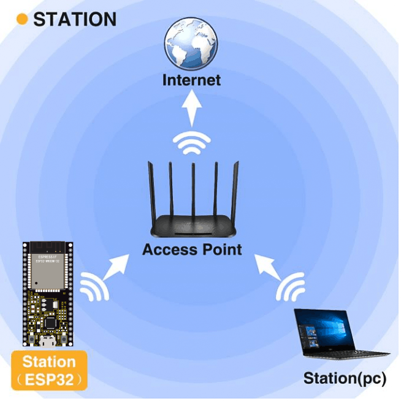

**1. Description**

We connect the smart home to a LAN, which is the WiFi in your home or the hot spot of your phone. After the connection is successful, an address will be assigned, which can be used for communication. We will print the assigned address in the serial monitor.

**2. Test Code**

Note: ssiD and password in the code should be filled with your own WiFi name and password.

| \#include \<Arduino.h\> \#include \<WiFi.h\> \#include \<ESPmDNS.h\> \#include \<WiFiClient.h\>  String item = "0"; const char\* ssid = "ChinaNet-2.4G-0DF0"; const char\* password = "ChinaNet@233"; WiFiServer server(80);  void setup() {  Serial.begin(115200);  WiFi.begin(ssid, password);  while (WiFi.status() != WL_CONNECTED) {  delay(500);  Serial.print(".");  }  Serial.println("");  Serial.print("Connected to ");  Serial.println(ssid);  Serial.print("IP address: ");  Serial.println(WiFi.localIP());  server.begin();  Serial.println("TCP server started");  MDNS.addService("http", "tcp", 80); }  void loop() {  Serial.print("Connected to ");  Serial.println(ssid);  Serial.print("IP address: ");  Serial.println(WiFi.localIP()); //The assigned IP address is printed on the serial monitor   delay(200);  WiFiClient client = server.available();  if (!client) {  return;  }  while(client.connected() && !client.available()){  delay(1);  }  String req = client.readStringUntil('\\r');  int addr_start = req.indexOf(' ');  int addr_end = req.indexOf(' ', addr_start + 1);  if (addr_start == -1 \|\| addr_end == -1) {  Serial.print("Invalid request: ");  Serial.println(req);  return;  }  req = req.substring(addr_start + 1, addr_end);  item=req;  Serial.println(item);  String s;  if (req == "/") //Browser accesses address can read the information sent by the client.println(s);  {  IPAddress ip = WiFi.localIP();  String ipStr = String(ip[0]) + '.' + String(ip[1]) + '.' + String(ip[2]) + '.' + String(ip[3]);  s = "HTTP/1.1 200 OK\\r\\nContent-Type: text/html\\r\\n\\r\\n\<!DOCTYPE HTML\>\\r\\n\<html\>Hello from ESP32 at ";  s += ipStr;  s += "\</html\>\\r\\n\\r\\n";  Serial.println("Sending 200");  client.println(s); //Send the string S, you can read the information when visiting the address of E smart home using a browser.   //client.print(s);  client.stop(); } |

**3. Test Result**

If the WiFi is connected successfully, the serial monitor will print out the assigned IP address.

Open a browser to access the IP address, then we will read the contents of the string S sent out by the client.println(s); in the code.

### Project 12.2 Control Smart Home

**1. Description**

In this project, we will learn how to realize different functions of the smart home through accessing different strings under the address. There is a LCD screen that can print out the IP address, which is much more convenient.

**2. Test Code**

| \#include \<Arduino.h\> \#include \<WiFi.h\> \#include \<ESPmDNS.h\> \#include \<WiFiClient.h\>  String item = "0"; const char\* ssid = "ChinaNet-2.4G-0DF0"; const char\* password = "ChinaNet@233"; WiFiServer server(80);  \#include \<Wire.h\> \#include \<LiquidCrystal_I2C.h\> LiquidCrystal_I2C mylcd(0x27,16,2); \#include \<analogWrite.h\> \#define fanPin1 19 \#define fanPin2 18 \#define led_y 12 //Define the yellow led pin to 12  void setup() {  Serial.begin(115200);  mylcd.init();  mylcd.backlight();  pinMode(led_y, OUTPUT);  pinMode(fanPin1, OUTPUT);  pinMode(fanPin2, OUTPUT);    WiFi.begin(ssid, password);  while (WiFi.status() != WL_CONNECTED) {  delay(500);  Serial.print(".");  }  Serial.println("");  Serial.print("Connected to ");  Serial.println(ssid);  Serial.print("IP address: ");  Serial.println(WiFi.localIP());  server.begin();  Serial.println("TCP server started");  MDNS.addService("http", "tcp", 80);  mylcd.setCursor(0, 0);  mylcd.print("ip:");  mylcd.setCursor(0, 1);  mylcd.print(WiFi.localIP()); //LCD displays the ip adress }  void loop() {  WiFiClient client = server.available();  if (!client) {  return;  }  while(client.connected() && !client.available()){  delay(1);  }  String req = client.readStringUntil('\\r');  int addr_start = req.indexOf(' ');  int addr_end = req.indexOf(' ', addr_start + 1);  if (addr_start == -1 \|\| addr_end == -1) {  Serial.print("Invalid request: ");  Serial.println(req);  return;  }  req = req.substring(addr_start + 1, addr_end);  item=req;  Serial.println(item);  String s;  if (req == "/") //Browser accesses address can read the information sent by the client.println(s);  {  IPAddress ip = WiFi.localIP();  String ipStr = String(ip[0]) + '.' + String(ip[1]) + '.' + String(ip[2]) + '.' + String(ip[3]);  s = "HTTP/1.1 200 OK\\r\\nContent-Type: text/html\\r\\n\\r\\n\<!DOCTYPE HTML\>\\r\\n\<html\>Hello from ESP32 at ";  s += ipStr;  s += "\</html\>\\r\\n\\r\\n";  Serial.println("Sending 200");  client.println(s); //Send the string S, you can read the information when visiting the address of E smart home using a browser.   //client.print(s);  }  if(req == "/led/on") //Browser accesses the ip address/led/on  {  client.println("turn on the LED");  digitalWrite(led_y, HIGH);  }  if(req == "/led/off") //Browser accesses the ip address/led/off  {  client.println("turn off the LED");  digitalWrite(led_y, LOW);  }  if(req == "/fan/on") //Browser accesses the ip address/fan/on  {  client.println("turn on the fan");  digitalWrite(fanPin1, LOW); //pwm = 0  analogWrite(fanPin2, 180);  }  if(req == "/fan/off") //Browser accesses the ip address/fan/off  {  client.println("turn off the fan");  digitalWrite(fanPin1, LOW); //pwm = 0  analogWrite(fanPin2, 0);  }  //client.print(s);  client.stop(); } |

**3. Test Result**

If the smart home is successfully connected to WiFi, the LCD screen will display the assigned address.

Accessing address must add / led/on when using the browser, such as my address is 192.168.0.129/ led/on. Then the smart home LED lights will be turned on, if accessing 192.168.0.129/ led /off, then the LED lights will be off.

When the browser accesses 192.168.0.129/fan/ on, the fan of

the smart home will be turned on and at 192.168.0.129/fan/ off will be turned off.

### Project 13.1: Mobile Phone APP test

**Download APP**

**Android APP：**

The Android apk installation package is available in our resource pack, as shown below:

Download from Google play:

Please search for keyes IoT home on Google play to download it.

**Icon:**

APP [Interface](C:/Users/NINGMEI/AppData/Local/youdao/dict/Application/8.10.7.0/resultui/html/index.html#/javascript:;)

**Download iOS APP**

Please search for keyes IoT home on APP Store to download it.

**1. Description**

We will use APP to control the smart home LED lights and fan switches.

**2. Test Code**

| \#include \<Arduino.h\> \#include \<WiFi.h\> \#include \<ESPmDNS.h\> \#include \<WiFiClient.h\>  String item = "0"; const char\* ssid = "ChinaNet-2.4G-0DF0"; const char\* password = "ChinaNet@233"; WiFiServer server(80);  \#include \<Wire.h\> \#include \<LiquidCrystal_I2C.h\> LiquidCrystal_I2C mylcd(0x27,16,2); \#include \<analogWrite.h\> \#define fanPin1 19 \#define fanPin2 18 \#define led_y 12 //Define the yellow led pin to 12  void setup() {  Serial.begin(115200);  mylcd.init();  mylcd.backlight();  pinMode(led_y, OUTPUT);  pinMode(fanPin1, OUTPUT);  pinMode(fanPin2, OUTPUT);    WiFi.begin(ssid, password);  while (WiFi.status() != WL_CONNECTED) {  delay(500);  Serial.print(".");  }  Serial.println("");  Serial.print("Connected to ");  Serial.println(ssid);  Serial.print("IP address: ");  Serial.println(WiFi.localIP());  server.begin();  Serial.println("TCP server started");  MDNS.addService("http", "tcp", 80);  mylcd.setCursor(0, 0);  mylcd.print("ip:");  mylcd.setCursor(0, 1);  mylcd.print(WiFi.localIP()); //LCD displays ip adress }  void loop() {  WiFiClient client = server.available();  if (!client) {  return;  }  while(client.connected() && !client.available()){  delay(1);  }  String req = client.readStringUntil('\\r');  int addr_start = req.indexOf(' ');  int addr_end = req.indexOf(' ', addr_start + 1);  if (addr_start == -1 \|\| addr_end == -1) {  Serial.print("Invalid request: ");  Serial.println(req);  return;  }  req = req.substring(addr_start + 1, addr_end);  item=req;  Serial.println(item);  String s;  if (req == "/") //Browser accesses address can read the information sent by the client.println(s);  {  IPAddress ip = WiFi.localIP();  String ipStr = String(ip[0]) + '.' + String(ip[1]) + '.' + String(ip[2]) + '.' + String(ip[3]);  s = "HTTP/1.1 200 OK\\r\\nContent-Type: text/html\\r\\n\\r\\n\<!DOCTYPE HTML\>\\r\\n\<html\>ESP32 ip:";  s += ipStr;  s += "\</html\>\\r\\n\\r\\n";  Serial.println("Sending 200");  client.println(s); //Send the string S, then you can read the information when visiting the address of E smart home using a browser.  }  if(req == "/led/on") //Browser accesses address ip address/led/on  {  client.println("turn on the LED");  digitalWrite(led_y, HIGH);  }  if(req == "/led/off") //Browser accesses address ip address/led/off  {  client.println("turn off the LED");  digitalWrite(led_y, LOW);  }  if(req == "/fan/on") //Browser accesses address ip address/fan/on  {  client.println("turn on the fan");  digitalWrite(fanPin1, LOW); //pwm = 0  analogWrite(fanPin2, 180);  }  if(req == "/fan/off") //Browser accesses address ip address/fan/off  {  client.println("turn off the fan");  digitalWrite(fanPin1, LOW); //pwm = 0  analogWrite(fanPin2, 0);  }  //client.print(s);  client.stop(); } |

**3. Test Result**

1\. Open the APP and select WIFI

2\. APP controls LED and the fan

The mobile phone and the smart home must share the same WiFi, or the smart home connects to the hotspot of the mobile phone.

APP input IP address (LCD1602 displays the assigned IP address), then click connect, the connection is successful if ESP32 IP: 192.168...... is displayed.

Next, you can click the LED, then the smart home LED will be turned on. Click the fan button and the fan will be turned on, as shown below:

### Project 13.2 IoT Smart Home

**1. Description**

The IOT smart home connects to the family WiFi through

WiFi, and the mobile phone used for operation should also be connected to the same WiFi.

What’s more, the smart home also can connect to the hotspot of the mobile phone. If the connection is successful, the LCD1602 will display the IP address. Using the phone APP to input the corresponding IP for communication is

enable to realize the APP control of various functions of the smart home.

**2. Test Code**

Please refer to the sample code, as shown below:

**3. Test Result**

## 8.Resources

Download code, libraries and more details, please refer to the following link:

https://fs.keyestudio.com/KS5009
